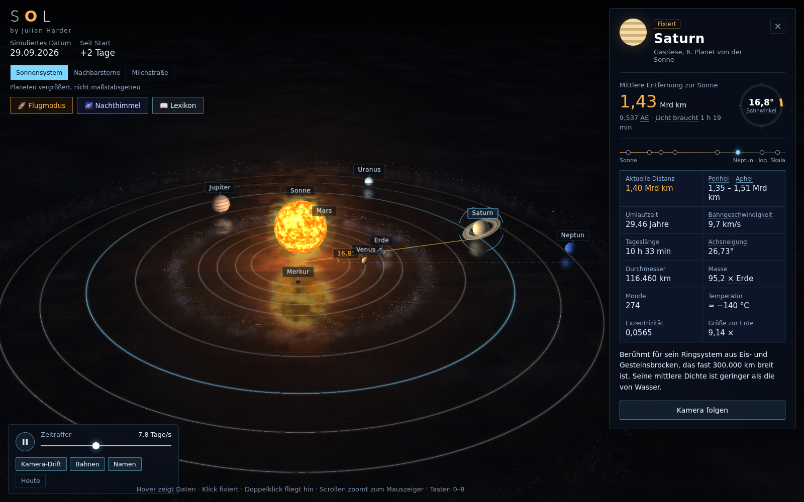
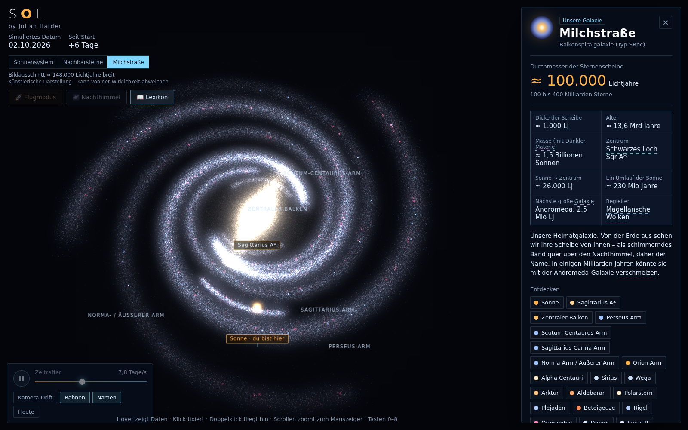
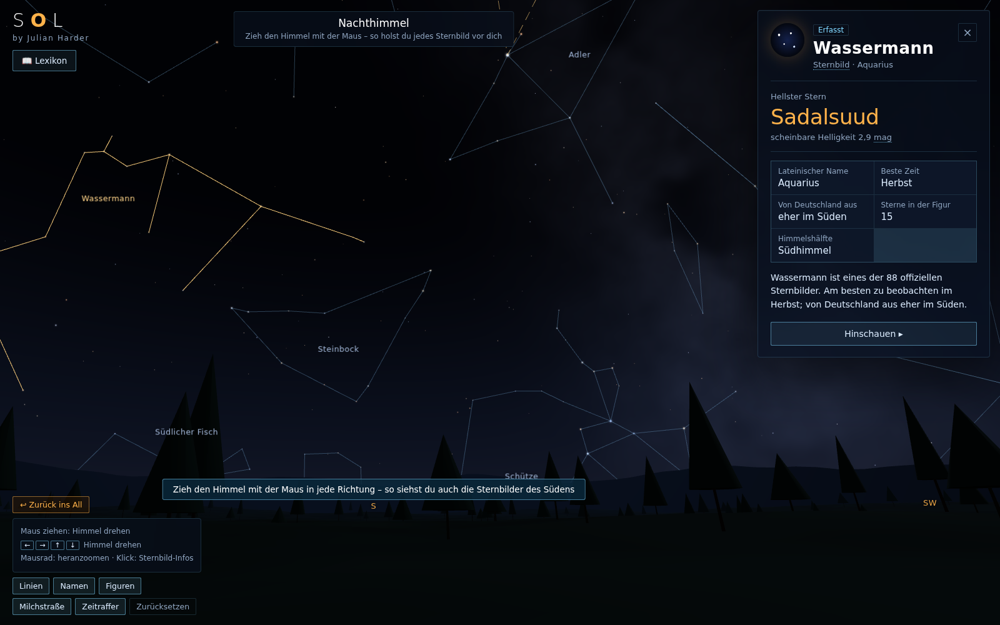
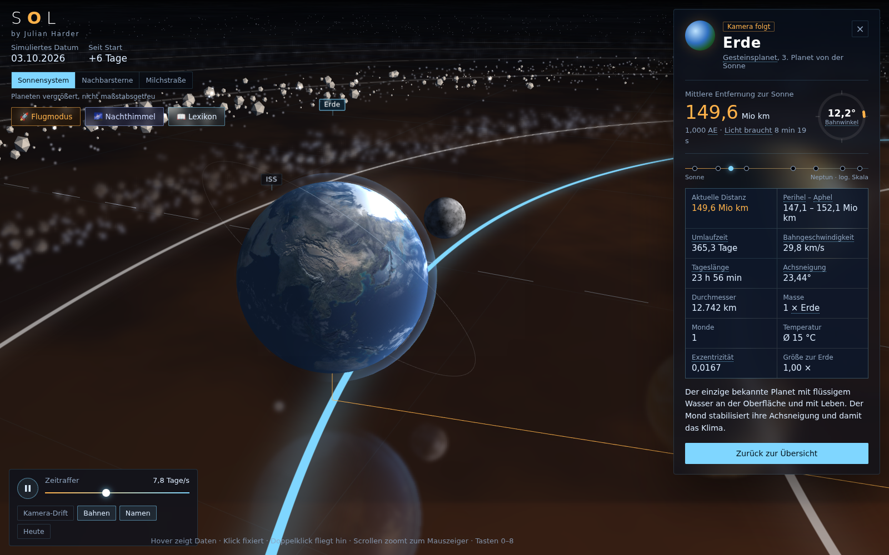

# S☉L – Interaktives 3D-Sonnensystem im Browser

**S☉L** ist eine interaktive 3D-Visualisierung des Sonnensystems, die vollständig im Browser läuft – vom eigenen Sonnensystem über die nächsten Sterne bis zur ganzen Milchstraße, dazu ein begehbarer Nachthimmel mit allen 88 Sternbildern und ein Flugmodus mit kleinen Wissens-Missionen.

Das Projekt ist eine einzelne, in sich geschlossene HTML-Datei ohne Build-Prozess, Server oder Abhängigkeiten, die installiert werden müssten. Einfach öffnen und loslegen.

(Die beste Darstellung ist auf einem großem Bildschirm z.b. am PC. Es wurde nur sehr beschränkt für eine Handyansicht konfiguriert)

**[▶ Live-Demo ansehen](https://julianharder.github.io/SOL---interaktives-3D-Sonnensystem/)**

<p align="center">
  
</p>
<p align="center">
  
  
  
</p>

---

## Inhaltsverzeichnis

- [Überblick](#überblick)
- [Features](#features)
  - [Sonnensystem](#1-sonnensystem)
  - [Flugmodus & Missionen](#2-flugmodus--missionen)
  - [Nachbarsterne](#3-nachbarsterne)
  - [Milchstraße](#4-milchstraße)
  - [Nachthimmel](#5-nachthimmel--sternbilder)
  - [Lexikon](#6-lexikon)
- [Technologie-Stack](#technologie-stack)
- [Projektstruktur](#projektstruktur)
- [Installation & Nutzung](#installation--nutzung)
- [Steuerung](#steuerung)
- [Datenquellen & Credits](#datenquellen--credits)
- [Bekannte Einschränkungen](#bekannte-einschränkungen)
- [Ideen für die Zukunft](#ideen-für-die-zukunft)
- [Lizenz](#lizenz)
- [Danksagung](#danksagung)

---

## Überblick

S☉L entstand als Lernprojekt während meiner Umschulung zum Fachinformatiker Anwendungsentwicklung. Ziel war es, mit **Three.js** eine möglichst überzeugende, aber trotzdem performante 3D-Szene zu bauen – und dabei nicht nur hübsch anzusehen, sondern auch **wissenschaftlich fundiert und lehrreich** zu sein: reale Bahndaten, reale Sternkataloge, reale Entfernungen (in gestauchter, aber nachvollziehbarer Darstellung) und ein eingebautes Lexikon für alle Fachbegriffe.

Die Anwendung ist als durchgehender Zoom aufgebaut: Man startet bei den Planeten, kann bis zu den nächsten Sternen herauszoomen und landet am Ende bei der ganzen Milchstraße – alles in einer einzigen, nahtlosen Kamerafahrt ohne Szenenwechsel.

## Features

### 1. Sonnensystem

- Alle 8 Planeten mit **prozedural generierten Oberflächentexturen** (kein einziges externes Bild – alles wird zur Laufzeit aus Rauschfunktionen berechnet)
  (Die Erde verwendet Texturen aus einem eigenen 3D-Erdmodell (erstellt mit Claude Design))
- Reale Bahnparameter (Exzentrizität, Perihel/Aphel, Neigung) – die Positionen der Planeten entsprechen näherungsweise dem aktuellen Datum
- Saturn- und Uranusringe, Erdwolken samt Mond, Asteroiden- und Kuipergürtel
- Die **ISS**, die sichtbar um die Erde kreist
- Spiegelnder Boden, Bloom-Beleuchtung, animierte Sonnenoberfläche (GLSL-Shader)
- Zeitraffer-Regler (0,1 Tage/s bis mehrere Jahre/s), Klick/Hover-Infopanel mit Live-Werten (aktuelle Distanz, Bahnwinkel, Umlaufzeit, Lichtlaufzeit …)
- Kamera folgt einem angewählten Himmelskörper auf seiner Bahn

### 2. Flugmodus & Missionen

- Freies Fliegen mit einem kleinen Raumschiff durchs Sonnensystem (Tastatur- und Maussteuerung, Touch-Support)
- **Autopilot**, der selbstständig zu einem Ziel navigiert, dabei der Sonne ausweicht und in eine Umlaufbahn einschwenkt
- Cockpit-HUD mit Geschwindigkeit (in Vielfachen der Lichtgeschwindigkeit) und **echten Reisezeiten** (Licht / Raumsonde / Auto) zum gewählten Ziel
- Begrenzter Flugraum knapp hinter dem Kuipergürtel mit visueller Energieschild-Grenze
- **10 Wissens-Missionen** („Flieg zum Planeten mit den meisten Monden“ etc.) mit Punktesystem, Hinweisen und Abbruchoption

### 3. Nachbarsterne

- Reale, mit bloßem Auge sichtbare Nachbarsterne (Sirius, Alpha Centauri, Beteigeuze, Wega, Rigel, Plejaden, Orionnebel …) in ihrer echten Richtung und Entfernung von der Sonne
- Beim Heranfliegen wird aus dem Lichtpunkt ein echter 3D-Stern mit realistischer Farbe, Größe und Oberflächenanimation
- Doppelsternsysteme (Alpha Centauri, Sirius/Sirius B) und Sternhaufen werden korrekt dargestellt

### 4. Milchstraße

- Eigenes prozedurales Spiralarm-Modell, das sich an den publizierten Radio-Parallaxen-Messungen von **Reid et al. (2019, ApJ 885, 131)** orientiert – reale Steigungswinkel und Referenzradien für Scutum-Centaurus-, Perseus-, Sagittarius- und Norma-Arm
- Zentraler Balken, 3-Kiloparsec-Arme, Staubbänder, H-II-Regionen (Gasnebel) und junge Sternhaufen entlang der Arme
- Die Sonne ist an ihrer realen Position im Orion-Arm markiert
- Zoom ist außerhalb der unmittelbaren Sonnenumgebung bewusst begrenzt (künstlerische Darstellung, kein beliebiges Hineinzoomen in einzelne Sterne)

### 5. Nachthimmel & Sternbilder

- Begehbare Nachthimmel-Ansicht: Der Himmel lässt sich mit der Maus in jede Richtung drehen (auch unter den Horizont, um z. B. das Kreuz des Südens zu sehen)
- **2.851 reale Sterne** (Hipparcos-Katalog, bis 5,5 mag) in ihrer echten Farbe und Helligkeit
- Alle **88 offiziellen Sternbilder** mit Linien und deutschen Namen
- Zusätzlich bekannte **Asterismen** (Großer Wagen, Kleiner Wagen, Sommerdreieck, Wintersechseck, Oriongürtel …), die keine eigenen offiziellen Sternbilder sind
- Milchstraßenband als Hintergrundschimmer, Zeitraffer der Himmelsdrehung
- Infokarten mit hellstem Stern, bester Beobachtungszeit und Sichtbarkeit von Deutschland aus

### 6. Lexikon

- Über 45 astronomische Fachbegriffe (AE, Lichtjahr, Exzentrizität, Perihel/Aphel, Spektralklasse, Schwarzes Loch, Zirkumpolar …) kurz und verständlich erklärt
- Fachbegriffe werden automatisch in den Infofeldern erkannt und verlinkt – Hover/Tap zeigt eine Kurzerklärung
- Durchsuchbare Gesamtübersicht über einen eigenen Button

## Technologie-Stack

| Bereich | Eingesetzt |
|---|---|
| 3D-Rendering | [Three.js](https://threejs.org/) r128 (`WebGLRenderer`, `EffectComposer`, `UnrealBloomPass`, `Reflector`) |
| Shader | eigene GLSL-Vertex-/Fragment-Shader für Sonnenoberfläche, Sternoberflächen, Bahnlinien, Bodenspiegelung, Himmelskuppel |
| Sprache | Vanilla JavaScript (ES6+), kein Framework |
| Layout | reines CSS (Custom Properties, `backdrop-filter`, responsive Breakpoints) |
| Daten | selbst berechnete Himmelsmechanik + externer Sternkatalog (siehe unten) |
| Build-Tools | keine – eine einzelne HTML-Datei |

## Projektstruktur

```
index.html   ← Offline-Variante, Three.js vollständig eingebettet (ca. 970 KB, funktioniert ohne Internetverbindung/CDN), insgesamte Dateigröße bei ca 1,9 MB
```

Bewusst als **eine Datei** gehalten, damit sie sich ohne Server, npm-Installation oder Bundler einfach weitergeben, herunterladen und lokal öffnen lässt. Bei einem größeren Ausbau des Projekts wäre eine Aufteilung in Module (Sonnensystem, Galaxie, Nachthimmel, Flugmodus, UI) der nächste sinnvolle Schritt.

## Installation & Nutzung

Keine Installation nötig.

1. `Sonnensystem.html` herunterladen (oder das Repository klonen)
2. Datei per Doppelklick im Browser öffnen
3. Fertig

**Voraussetzung:** Ein aktueller Browser mit aktiviertem WebGL (Chrome, Edge, Firefox, Safari – Desktop und Mobile). Zu testen unter [get.webgl.org](https://get.webgl.org/).

> Die Seite ist in erster Linie für **größere Bildschirme** konzipiert. Auf Smartphones funktioniert sie ebenfalls (eigens angepasstes Layout, Wisch-Steuerung, aufklappbares Infofeld), kommt dort aber naturgemäß nicht so gut zur Geltung wie am Desktop.

## Steuerung

| Aktion | Eingabe |
|---|---|
| Kamera drehen | Maus ziehen |
| Zoomen (zum Mauszeiger) | Mausrad |
| Objekt auswählen | Klick / Tap auf Himmelskörper oder Beschriftung |
| Zur Übersicht zurück | Klick ins Leere / Esc |
| Schnellauswahl | Zifferntasten 0–8 |
| **Flugmodus** | Schub/Bremse `W`/`S`, Lenken `A`/`D`, Höhe `↑`/`↓`, Boost `Shift`, Autopilot `P`, Cockpit-Ansicht `V` |
| **Nachthimmel** | Himmel mit Maus ziehen, Zoom über Mausrad |

## Datenquellen & Credits

- **Sternkatalog & Sternbild-Linien:** [d3-celestial](https://github.com/ofrohn/d3-celestial) von Olaf Frohn (BSD-Lizenz), basierend auf dem Hipparcos- bzw. Yale Bright Star Catalog
- **Spiralarm-Modell der Milchstraße:** Parameter nach Reid, M. J. et al. (2019), *Trigonometric Parallaxes of High-Mass Star-Forming Regions: Our View of the Milky Way*, The Astrophysical Journal, 885, 131
- Alle Planetentexturen, Nebel, Sternoberflächen und die Bodenreflexion sind **prozedural generiert** (eigener Simplex-/Value-Noise-Code) – es werden keine fremden Bildmaterialien verwendet
  (Die Erde verwendet Texturen aus einem eigenen 3D-Erdmodell (erstellt mit Claude Design))

## Bekannte Einschränkungen

- Abstände und Größen im Sonnensystem sind zur besseren Darstellung **gestaucht**, nicht maßstabsgetreu (wird in der App auch so ausgewiesen)
- Die Milchstraßen-Darstellung ist eine **künstlerische Annäherung** – die Spiralstruktur unserer Galaxie ist bis heute nicht vollständig vermessen, da wir uns mitten in ihr befinden
- Monde sind bislang nur bei der Erde vorhanden; andere Planetenmonde fehlen noch
- Getestet primär mit Software-Rendering; auf schwächerer Hardware kann die Bildrate sinken (ein Performance-/Leistungsmodus ist als Ausbaustufe denkbar)

## Ideen für die Zukunft

- [ ] Größenvergleich der Planeten nebeneinander
- [ ] Jahreszeiten- und Mondphasen-Visualisierung an der Erde
- [ ] Monde der anderen Planeten (z. B. die vier großen Jupitermonde)
- [ ] 3D-Darstellung von Sternbildern bei den Nachbarsternen (Perspektivwechsel zeigt, wie sich Sternbilder aus anderen Blickwinkeln auflösen)
- [ ] Leistungsmodus für schwächere Geräte

## Lizenz

Dieses Projekt dient als persönliches Lern- und Portfolio-Projekt. Sternkatalog-Daten von d3-celestial stehen unter der BSD-Lizenz; die Nutzung/Attribution dieses Datensatzes ist entsprechend oben vermerkt.

## Danksagung

Dieses Projekt wurde **mit Unterstützung von Claude (Anthropic)** entwickelt und iterativ verfeinert – von der ersten 3D-Szene über die Milchstraßen-Rekonstruktion nach realen Messdaten bis zur Mobile-Optimierung.

---

**Erstellt von [Julian Harder](https://github.com/)** im Rahmen der Umschulung zum Fachinformatiker Anwendungsentwicklung.
